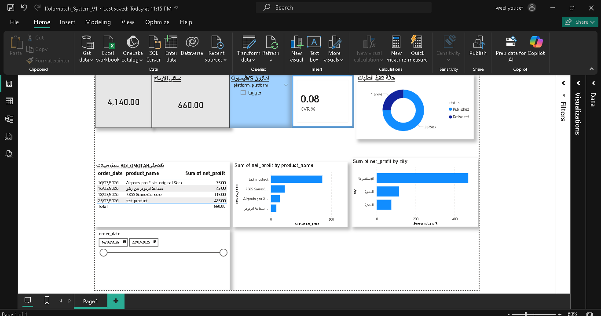

# Kolomotah_Ecomm_BI_System
An end-to-end Business Intelligence system for an E-commerce startup (Kolomotah) built with Python ETL, MySQL 8.4, and Power BI to track profitability across multi-channel platforms (Amazon &amp; Facebook)."
# 🛒 Kolomotah: Multi-Channel E-commerce BI System

## 📊 Project Overview
**Kolomotah** is a real-world Business Intelligence solution I built to manage my own e-commerce venture. The system integrates data from multiple sales channels (Amazon Affiliate & Facebook Dropshipping) into a centralized MySQL 8.4 data warehouse using an automated Python ETL pipeline.

### 🎯 Key Business Problems Solved:
*   **Profitability Tracking:** Calculating net profit after deducting platform fees, shipping, and marketing spend.
*   **Multi-Platform Analysis:** Comparing performance between Amazon (UAE/Egypt) and Facebook Marketplace.
*   **Marketing Efficiency:** Monitoring **Conversion Rates (CVR%)** based on link clicks and confirmed orders.

---

## 📸 Dashboard Preview

---

## 🔄 The Technical Architecture
1.  **Data Ingestion (Excel):** Light-weight data entry for daily operations.
2.  **ETL Pipeline (Python/Pandas):** Automated script to clean column headers (lowercase/strip), handle NULLs, and sync data to MySQL.
3.  **Data Modeling (SQL 8.4):** Designed relational tables with **Foreign Keys** for shipping rates and built complex **SQL Views** for real-time calculations.
4.  **Visualization (Power BI):** Developed an interactive dashboard with dynamic slicing by region, platform, and order status.

## 👤 Author
**Wael Yousef**
*Data Analyst | Commercial Insights Specialist | 17 Years Auditing Experience*

*   🌐 **Portfolio:** [waelanalytics.carrd.co](https://waelanalytics.carrd.co/)
*   💼 **LinkedIn:** [Wael Yousef](https://www.linkedin.com/in/wael-yousef-analyst/)
